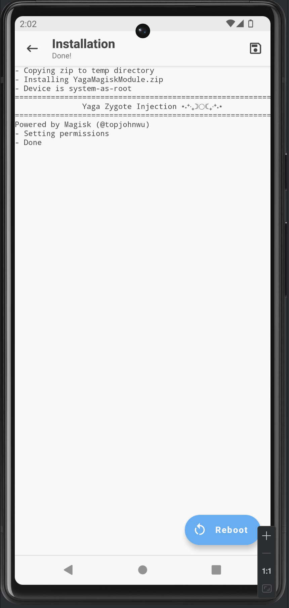
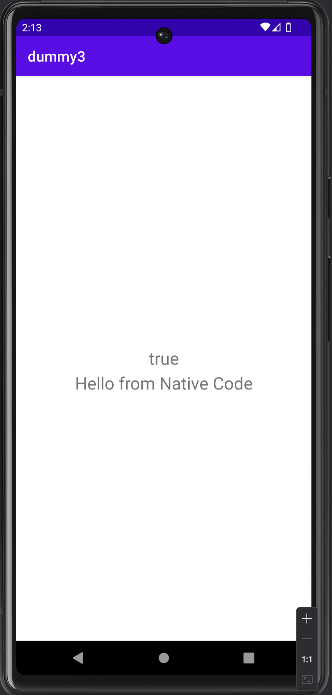
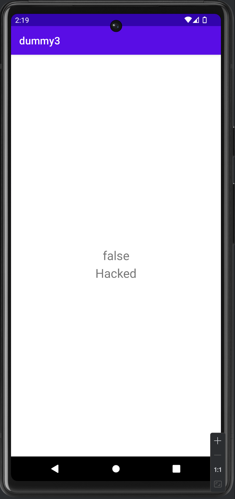

<p align="center">
  
</p>

<div align="center">


[](/LICENSE)

</div>

---

<p align="center"> Attack to Zygote like Riru & libart.so hooking for runtime manipulation of Dex and native code
    <br> 
</p>

## 📝 Table of Contents

- [About](#about)
- [Prerequisites](#about)
- [Installing](#getting_started)
- [Usage](#usage)
- [Acknowledgments](#acknowledgement)

## 🧐 About <a name = "about"></a>

Yaga is a Proof-of-Concept around how Zygote Injection Attacks are performed and how it enables application code hooking,

The zygote is the first process started on Android, acting as a template or interface for the creation of other processes. Due to its elevated privileges, it can interact with any application, unlike the highly restricted communication between apps enforced by the system's SELinux policies. This makes it an interesting target for sandbox evasion, enabling hooking techniques in Dex code (Java/Kotlin) and native code (C/C++/Rust), which have proven to be extremely effective from a defense evasion perspective.

## ⚙️ Prerequisites

This project was tested on an Android 12 ("S") arm64 emulator using SDK 31.

To build the module, run one of the setup scripts included in the project:
```
./setup arm64
adb push YagaMagiskModule.zip /sdcard/Download
```

## 📦 Installing

Having a mobile with Magisk, you just need to install the module and reboot your system:
<div align="center">
  
</div>

## 🚀 Usage <a name="usage"></a>

Install the dummy3.apk from the example folder on an arm64 emulator and run it once. Then, push the mydex.dex file to the internal files directory of dummy3 at /data/data/com.example.dummy3/files/.

<table align="center">
  <tr>
    <td align="center"><br><b>Before Hook</b></td>
    <td align="center"><br><b>After Hook</b></td>
  </tr>
</table>

## 🎉 Acknowledgements <a name = "acknowledgement"></a>

- [Magisk Modules by topjohnwu](https://topjohnwu.github.io/Magisk/guides.html)
- [Riru by RikkaApps](https://github.com/RikkaApps/Riru)
- [NbInjection by Canye](https://github.com/canyie/NbInjection?tab=readme-ov-file)
- [LSPlant by LSPosed](https://github.com/LSPosed/LSPlant)
- [Zygisk ImGui Mod Menu by reveny](https://github.com/reveny/Zygisk-ImGui-Mod-Menu)
- [YAHFA by PAGalaxyLab](https://github.com/PAGalaxyLab/YAHFA)
- [xHook by iqiyi](https://github.com/iqiyi/xHook)
- [Dobby by jmpews](https://github.com/jmpews/Dobby)