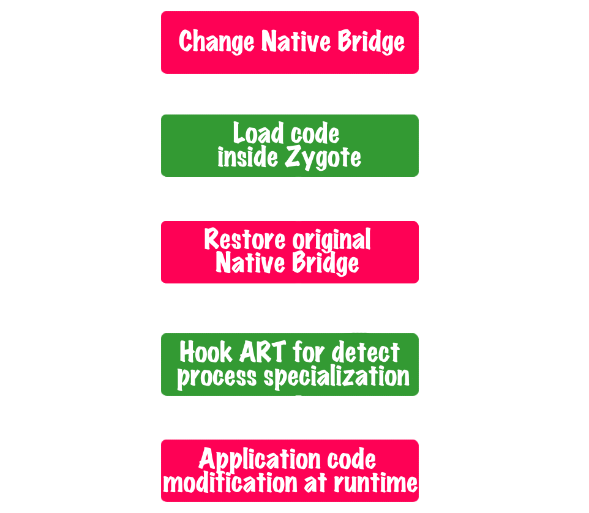
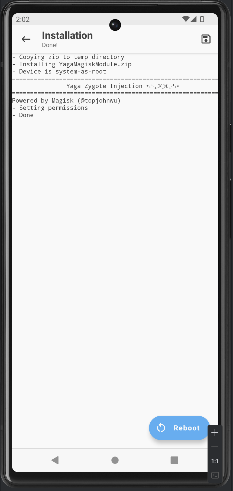
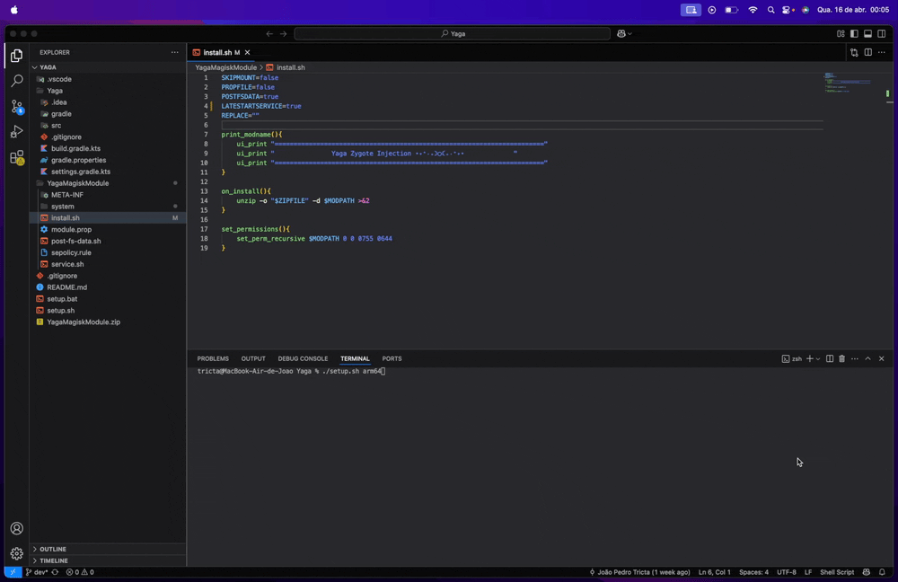

<p align="center">
  
</p>

<div align="center">


[](/LICENSE)

</div>

---

<p align="center"> Attack to Zygote like Riru
    <br> 
</p>

## 📝 Table of Contents

- [About](#about)
- [Prerequisites](#about)
- [Installing](#getting_started)
- [PoC](#poc)
- [Acknowledgments](#acknowledgement)

## 🧐 About <a name = "about"></a>

Yaga is a Proof-of-Concept around how Zygote Injection Attacks are performed! 

The zygote is the first process started on Android, acting as a template or interface for the creation of other processes. Due to its elevated privileges, it can interact with any application, unlike the highly restricted communication between apps enforced by the system's SELinux policies. This makes it an interesting target for sandbox evasion, enabling hooking techniques in Dex code (Java/Kotlin) and native code (C/C++/Rust), which have proven to be extremely effective from a defense evasion perspective.

For APK code hooking in both Dex and native code using Zygote Injection, see also: [Liho](https://github.com/hakaioffsec/Liho).

You can see the overall flow in the diagram below:
<div align="center">
  
</div>

## ⚙️ Prerequisites

To build the module, run one of the setup scripts included in the project:
```
./setup arm64
adb push YagaMagiskModule.zip /sdcard/Download
```

## 📦 Installing

Having a mobile with a Root Manager, like Magisk, you just need to install the module and reboot your system:
<div align="center">
  
</div>

## 🚀 PoC <a name="poc"></a>

<div align="center">
  
</div>

## 🎉 Acknowledgements <a name = "acknowledgement"></a>

- [Magisk Modules by topjohnwu](https://topjohnwu.github.io/Magisk/guides.html)
- [Riru by RikkaApps](https://github.com/RikkaApps/Riru)
- [NbInjection by Canye](https://github.com/canyie/NbInjection?tab=readme-ov-file)
- [LSPlant by LSPosed](https://github.com/LSPosed/LSPlant)
- [xHook by iqiyi](https://github.com/iqiyi/xHook)